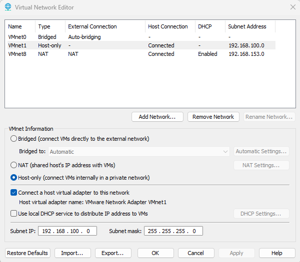

# 00 - Lab Setup (v1)

## Objective
Build a reusable enterprise-style home lab used across all portfolio projects (AD hardening, SIEM ingestion, attack simulation, vuln management, detection engineering).

## Architecture Overview
**Core Systems**
- Windows Server 2022: Domain Controller (AD DS, DNS)
- Windows 10: Domain-joined workstation
- Kali Linux: Attacker / testing host
- Wazuh: SIEM + endpoint monitoring

## Network Plan
| Component | Role | IP (Planned) | Notes |
|---|---|---:|---|
| DC01 | Domain Controller |  | Static IP |
| WIN10-01 | Client |  | DHCP or static |
| KALI-01 | Attacker |  | Same lab VLAN |
| WAZUH-01 | SIEM |  | Static IP recommended |

> Note: IPs will be finalized after VM creation.

## Build Steps (Initial)
### 1) Create VMs
- [ ] Create Windows Server 2022 VM (DC01)
- [ ] Create Windows 10 VM (WIN10-01)
- [ ] Create Kali Linux VM (KALI-01)
- [ ] Create Wazuh VM (WAZUH-01)

### 2) Configure Virtual Networking
- [ ] Create isolated lab network (internal / host-only)
- [ ] Confirm all VMs can ping each other
- [ ] Confirm internet access is available only if intended (document choice)

### 3) Baseline Snapshots
- [ ] Snapshot: “Fresh OS Install” for each VM
- [ ] Snapshot: “Network Verified” once connectivity confirmed

## Evidence
Screenshots will be stored in:
- `00-Lab-Setup/screenshots/`

Recommended screenshots:
- VM list showing all machines created
- IP config from each machine
- Successful ping tests between machines
- Snapshot manager showing baseline snapshots

## Lessons Learned / Notes
- (Place Notes here)

## Network Configuration

### Internal LAN (VMnet1)
- Subnet: 192.168.100.0/24
- DHCP: Disabled
- Purpose: Isolated enterprise lab network

### Planned Static IP Assignments
| Machine | Role | IP |
|----------|------|------|
| DC01 | Domain Controller | 192.168.100.10 |
| WIN10-01 | Client | 192.168.100.20 |
| WAZUH-01 | SIEM | 192.168.100.30 |
| KALI-01 | Attacker | 192.168.100.40 |

### Evidence

