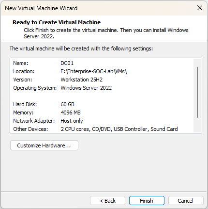
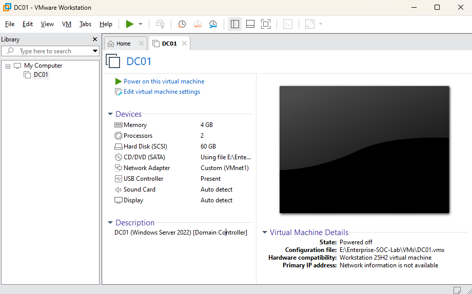

# 00 - Lab Setup (v1)

## Objective
Build a reusable enterprise-style SOC lab that will serve as the foundation for:

- Active Directory hardening
- SIEM deployment & log ingestion
- Attack simulation & incident response
- Vulnerability management
- Detection engineering

---

# Architecture Overview

## Core Systems
- **DC01** – Windows Server 2022 (Domain Controller, DNS)
- **WIN10-01** – Domain-joined workstation
- **KALI-01** – Attacker simulation host
- **WAZUH-01** – SIEM & log analysis platform

---

# Network Architecture

## Internal LAN (VMnet1)
- Subnet: `192.168.100.0/24`
- DHCP: Disabled
- Purpose: Isolated enterprise-style lab network

### Planned Static IP Assignments

| Machine | Role | IP |
|----------|------|------|
| DC01 | Domain Controller | 192.168.100.10 |
| WIN10-01 | Client | 192.168.100.20 |
| WAZUH-01 | SIEM | 192.168.100.30 |
| KALI-01 | Attacker | 192.168.100.40 |

---

# DC01 Infrastructure Provisioning

## Purpose
DC01 will serve as the centralized identity authority for the lab environment and will host:

- Active Directory Domain Services (AD DS)
- DNS
- Group Policy
- Administrative & user account management

---

## Configuration Decisions

| Component | Value | Rationale |
|-----------|--------|------------|
| Hypervisor | VMware Workstation Pro 25H2 | Enterprise-grade virtualization |
| VM Name | DC01 | Naming convention for enterprise clarity |
| OS | Windows Server 2022 (Evaluation) | Full AD DS functionality |
| CPU | 2 vCPU | Lightweight identity workload |
| RAM | 4 GB | Sufficient for AD + DNS |
| Disk | 60 GB (Thin Provisioned) | Allows log growth & snapshots |
| Disk Type | SCSI (LSI Logic SAS) | Enterprise-aligned configuration |
| Firmware | UEFI | Modern server standard |
| Network | VMnet1 (Host-Only) | Segmented internal LAN |
| Storage Location | E:\Enterprise-SOC-Lab\VMs\DC01 | Dedicated lab storage |

---

## Security & Design Considerations

- Host-only networking prevents exposure to the home network.
- Static IP enforcement improves log consistency for SIEM analysis.
- Thin provisioning conserves disk space while allowing controlled growth.
- Structured naming supports future incident documentation and log analysis.

---

# Evidence

### VMware Network Configuration

### DC01 VM Configuration Summary

### DC01 Provisioned

---

# Current Status

- [x] Isolated virtual network configured
- [x] DC01 virtual machine provisioned
- [ ] Windows Server installed
- [ ] Static IP configured
- [ ] AD DS role installed
- [ ] Domain promoted

